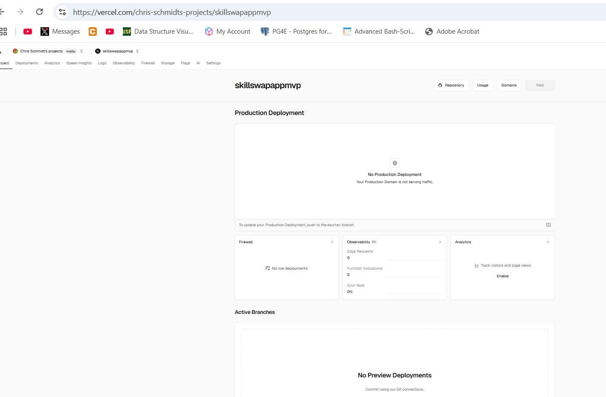

# Pull Request

## Description
<!-- Provide a clear and concise description of the changes implemented in this pull request -->

## Related Issue
<!-- Reference any related issues using the format: "Fixes #123" or "Relates to #123" -->

## Type of Change
<!-- Check the relevant option by putting an "x" in the brackets -->
- [ ] Bug fix (non-breaking change fixing an issue)
- [ ] New feature (non-breaking change adding functionality)
- [ ] Breaking change (fix or feature causing existing functionality to change)
- [ ] Documentation update
- [ ] Performance improvement
- [ ] Code refactoring (no functional changes)
- [ ] DevOps related (CI/CD, deployment, infrastructure)
- [ ] Other (please describe):

## Testing
<!-- Describe the testing you've done to validate your changes -->
- [ ] Unit tests added/updated
- [ ] Integration tests added/updated
- [ ] E2E tests added/updated
- [ ] Manual testing performed

## Deployment Impact
<!-- Describe any impact on deployment process or runtime environment -->
- [ ] Requires database migration
- [ ] Requires environment variable changes
- [ ] Requires dependency updates
- [ ] Requires infrastructure changes
- [ ] No deployment impact

## Screenshots
<!-- If applicable, add screenshots to help explain your changes -->

## Checklist
<!-- Go through the following checklist before requesting review -->
- [ ] My code follows the code style of this project
- [ ] I have updated the documentation accordingly
- [ ] I have added tests to cover my changes
- [ ] All new and existing tests passed
- [ ] My changes generate no new warnings or errors
- [ ] I have checked for accessibility issues
- [ ] I have verified mobile responsiveness

## Additional Notes
<!-- Add any other information about the PR here -->
