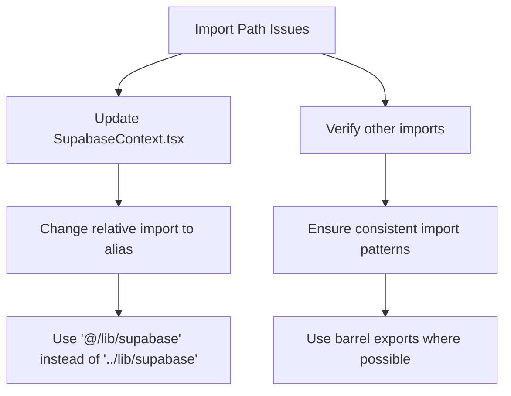
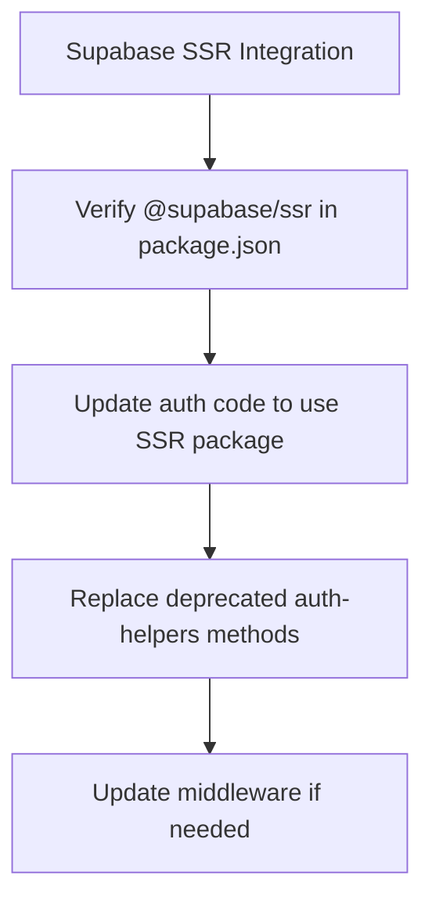
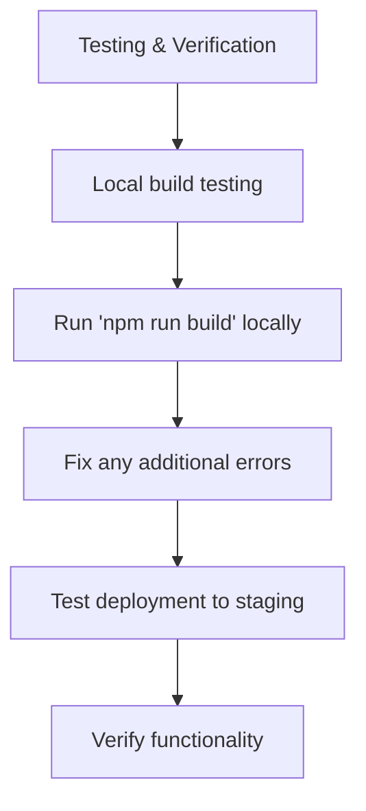
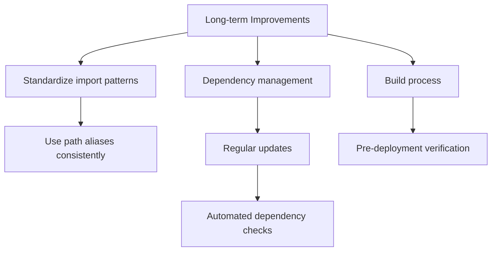

# Comprehensive Plan to Fix Deployment Issues

Based on analysis of the codebase and the error logs, we've identified the key issues preventing successful deployment and developed a comprehensive plan to resolve them.

## Current Issues

1. **Import Path Resolution Problems**:
   - The build is failing with `Module not found: Can't resolve '@/lib/supabase/client'`
   - In `SupabaseContext.tsx`, there's an incorrect import path: `import { supabaseClient as supabase } from '../lib/supabase'`
   - This should be using the proper alias path: `import { supabase } from '@/lib/supabase'`

2. **Missing Supabase SSR Dependency**:
   - Error: `Module not found: Can't resolve '@supabase/ssr'`
   - The package is listed in package.json but might need to be properly integrated in the code

## Solution Plan

Here's a step-by-step plan to fix these issues and successfully deploy the application:

### 1. Fix Import Path Issues

1. **Update SupabaseContext.tsx**:
   - Change `import { supabaseClient as supabase } from '../lib/supabase'` to `import { supabase } from '@/lib/supabase'`
   - This aligns with the barrel export pattern in `src/lib/supabase.ts`

2. **Verify all other Supabase imports**:
   - Search for any other instances of direct imports from `supabase/client` and update them to use the barrel export

### 2. Fix Supabase SSR Integration

1. **Verify the dependency**:
   - Confirm `@supabase/ssr` is properly installed (it is listed in package.json)

2. **Update auth code**:
   - Identify code using deprecated `@supabase/auth-helpers-nextjs` methods
   - Replace with equivalent methods from `@supabase/ssr`
   - This may involve updating middleware.ts and other auth-related files

### 3. Testing and Verification

1. **Local build testing**:
   - Run `npm run build` locally to catch any issues before deployment
   - Address any additional errors that appear

2. **Deployment testing**:
   - Deploy to staging environment
   - Verify all functionality works as expected

### 4. Long-term Improvements

1. **Standardize import patterns**:
   - Establish consistent use of path aliases
   - Use barrel exports (index.ts files) for cleaner imports

2. **Dependency management**:
   - Regularly update dependencies
   - Consider using tools like Dependabot

3. **Build process improvements**:
   - Implement pre-deployment verification steps
   - Add automated tests for build integrity

## Implementation Details

### Specific Files to Modify:

1. **src/contexts/SupabaseContext.tsx**:
   - Update the import from relative path to alias path
   - Change any auth methods that might be using deprecated APIs

2. **Any files using direct imports from supabase/client**:
   - Update to use the barrel exports from `@/lib/supabase`

3. **Files using deprecated auth helpers**:
   - Update to use the new `@supabase/ssr` package methods

### Deployment Process:

1. Make the necessary code changes
2. Test locally with `npm run build`
3. Run tests to ensure functionality is preserved
4. Deploy to staging using `npm run deploy:staging`
5. Verify the deployment works correctly
6. Deploy to production if staging is successful
