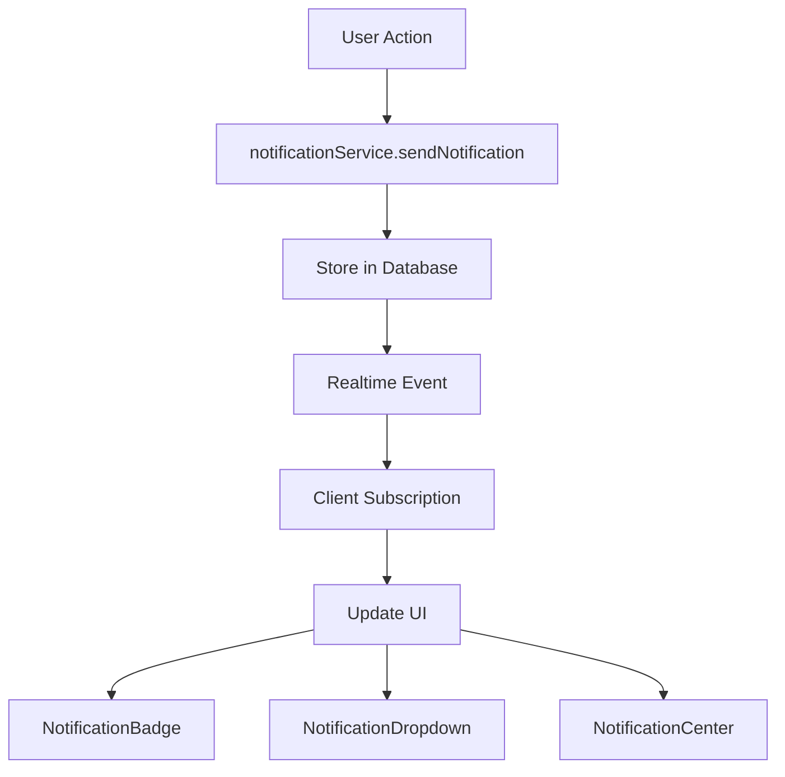
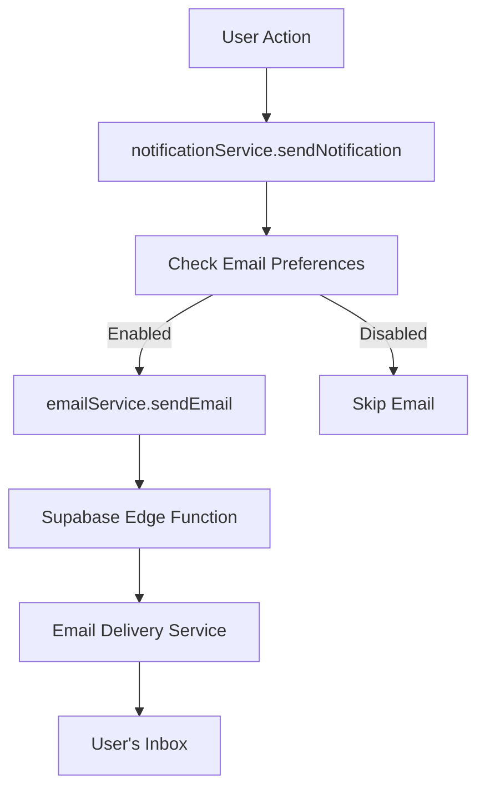
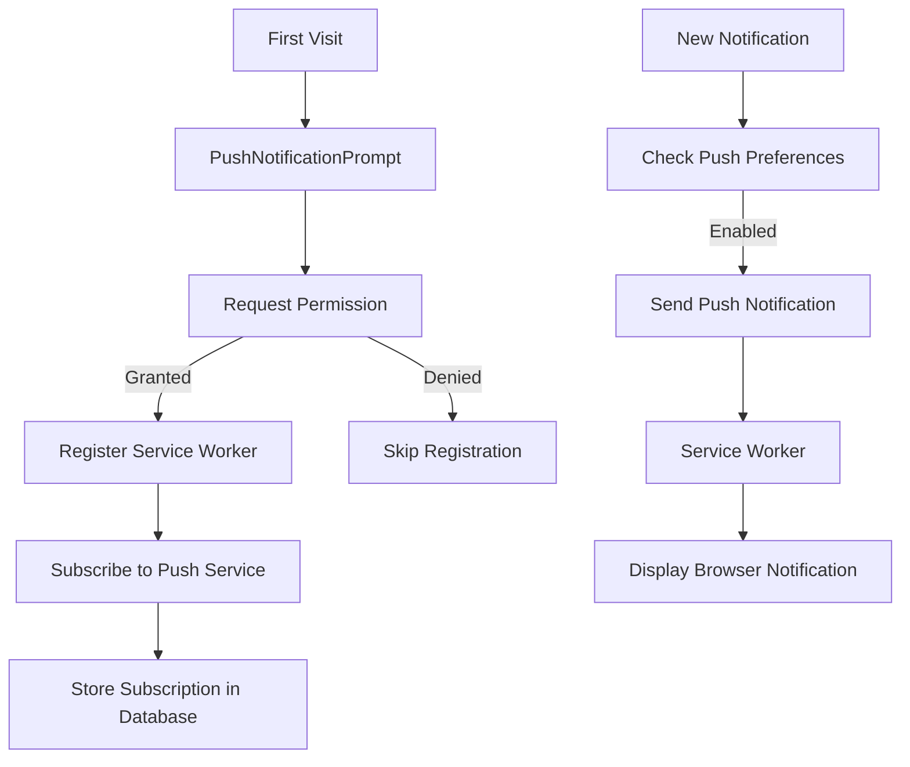

# Phase 8 Implementation Tracker: Notifications & Email Integration

This document tracks the implementation progress of Phase 8, focusing on enhancing the notification system and implementing email integration.

## Overview

Phase 8 focuses on building a comprehensive notification and communication system that will keep users informed about important events and activities within the SkillSwap platform. This includes real-time in-app notifications, email notifications, and web push notifications.

## Implementation Status

| Component | Description | Status |
|-----------|-------------|--------|
| **Real-time Notification System** | | |
| NotificationCenter | Dedicated page for viewing all notifications | ✅ Completed |
| NotificationBadge | UI component for unread counts in navigation | ✅ Completed |
| NotificationPreferences | UI for managing notification settings | ✅ Completed |
| Real-time subscription | Using Supabase Realtime for instant updates | ✅ Completed |
| Notification grouping | Grouping by type and context | ✅ Completed |
| Priority system | Different importance levels for notifications | ✅ Completed |
| **Email Integration** | | |
| EmailPreferencesForm | UI for managing email notification settings | ✅ Completed |
| EmailTemplatePreview | Preview component for email templates | ✅ Completed |
| Edge Function setup | Supabase function for sending emails | ✅ Completed |
| Email templates | Welcome, password reset, verification, trade notifications, etc. | ✅ Completed |
| Email analytics | Tracking delivery and engagement | ✅ Completed |
| **Push Notification Setup** | | |
| PushNotificationPrompt | UI for requesting browser permission | ✅ Completed |
| ServiceWorkerRegistration | Managing service worker for push notifications | ✅ Completed |
| Push subscription management | Backend for storing push subscriptions | ✅ Completed |
| Permission flow | UX for requesting and managing permissions | ✅ Completed |
| Notification scheduling | System for delayed notifications | ✅ Completed |
| **Notification Preference Management** | | |
| NotificationSettingsPage | Complete settings page for all preferences | ✅ Completed |
| ChannelPreferences | Managing delivery channels (in-app, email, push) | ✅ Completed |
| FrequencySettings | Controlling notification frequency | ✅ Completed |

## Technical Architecture

### Real-time Notification Flow

### Email Notification Flow

### Push Notification Flow

## Implementation Sequence

1. **Phase 8.1: Real-time Notification System Enhancement**
   - Implement NotificationCenter component
   - Create NotificationBadge component
   - Set up real-time subscription
   - Implement notification grouping

2. **Phase 8.2: Email Integration**
   - Set up Supabase Edge Function
   - Implement email templates
   - Create EmailPreferencesForm
   - Add email delivery tracking

3. **Phase 8.3: Push Notification System**
   - Create service worker setup
   - Implement permission flow
   - Set up push subscription management
   - Add notification scheduling

4. **Phase 8.4: Notification Preferences Management**
   - Create NotificationSettingsPage
   - Implement channel preferences
   - Add frequency controls
   - Implement "do not disturb" functionality

## Technical Considerations

1. **Performance Optimization**
   - Implement pagination for notification lists
   - Use optimistic UI updates for better UX
   - Implement proper caching strategies

2. **Security**
   - Ensure notifications only contain non-sensitive data
   - Implement proper authentication for push notifications
   - Add rate limiting for notification creation

3. **Testing**
   - Create comprehensive tests for notification delivery
   - Test email templates across different email clients
   - Verify push notification delivery on different browsers

## Current Focus

- Integrating deployed Edge Functions with the notification system
- Testing the email delivery pipeline with the completed templates
- Creating the NotificationSettingsPage component
- Implementing channel preferences for notification delivery
