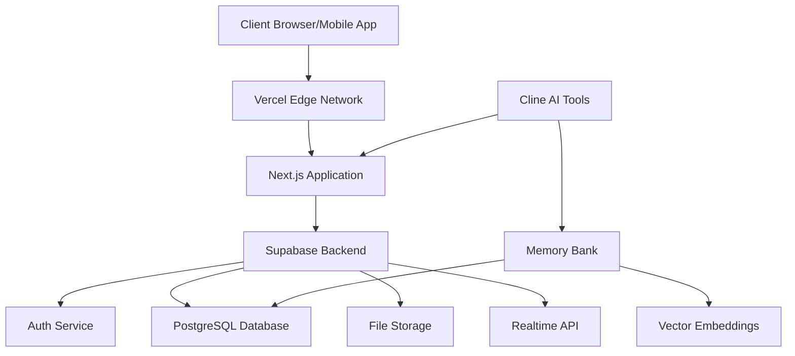

# SkillSwap MVP - Technical Architecture

This document outlines the technical architecture for the SkillSwap MVP, detailing system design, data models, and key components.

## System Architecture

SkillSwap follows a modern serverless architecture leveraging Supabase and Vercel:



### Key Components

1. **Next.js Frontend**
   - App Router for routing and server components
   - Tailwind CSS for styling
   - TypeScript for type safety

2. **Supabase Backend**
   - Authentication and user management
   - PostgreSQL database
   - Row Level Security policies
   - Real-time messaging and notifications

3. **Memory Bank**
   - SQLite local storage for development
   - PostgreSQL integration for production
   - Vector embeddings for semantic search

4. **Cline AI Integration**
   - Context-aware AI assistance
   - Tool implementations for skill matching
   - Memory integration for personalization

5. **React Native Mobile App**
   - Expo for cross-platform development
   - Shared components with web version
   - Native UI elements for mobile experience

## Database Schema

### Core Tables

#### Users Table
```sql
CREATE TABLE users (
  id UUID PRIMARY KEY DEFAULT uuid_generate_v4(),
  email TEXT UNIQUE NOT NULL,
  phone TEXT,
  full_name TEXT,
  bio TEXT,
  profile_image_url TEXT,
  location_city TEXT,
  location_state TEXT,
  location_country TEXT,
  location_lat FLOAT,
  location_lng FLOAT,
  location_visibility TEXT DEFAULT 'approximate', -- 'precise', 'approximate', 'city-only'
  created_at TIMESTAMP WITH TIME ZONE DEFAULT NOW(),
  updated_at TIMESTAMP WITH TIME ZONE DEFAULT NOW(),
  last_active_at TIMESTAMP WITH TIME ZONE DEFAULT NOW(),
  is_verified BOOLEAN DEFAULT FALSE,
  account_status TEXT DEFAULT 'active', -- 'active', 'suspended', 'deactivated'
  marketing_consent BOOLEAN DEFAULT FALSE,
  tos_accepted_version TEXT,
  tos_accepted_at TIMESTAMP WITH TIME ZONE,
  preferred_language TEXT DEFAULT 'en',
  preferred_currency TEXT DEFAULT 'USD',
  time_zone TEXT DEFAULT 'UTC'
);
```

#### Skills Table
```sql
CREATE TABLE skills (
  id UUID PRIMARY KEY DEFAULT uuid_generate_v4(),
  user_id UUID REFERENCES users(id) ON DELETE CASCADE,
  title TEXT NOT NULL,
  description TEXT,
  category TEXT NOT NULL,
  subcategory TEXT,
  experience_level TEXT, -- 'beginner', 'intermediate', 'expert'
  hourly_equivalent_value FLOAT, -- optional suggested value
  availability JSONB, -- days/times available
  is_offering BOOLEAN DEFAULT TRUE, -- TRUE if offering, FALSE if seeking
  is_remote_friendly BOOLEAN DEFAULT FALSE,
  created_at TIMESTAMP WITH TIME ZONE DEFAULT NOW(),
  updated_at TIMESTAMP WITH TIME ZONE DEFAULT NOW(),
  is_active BOOLEAN DEFAULT TRUE
);
```

#### Trades Table
```sql
CREATE TABLE trades (
  id UUID PRIMARY KEY DEFAULT uuid_generate_v4(),
  proposer_id UUID REFERENCES users(id),
  receiver_id UUID REFERENCES users(id),
  skill_offered_id UUID REFERENCES skills(id),
  skill_requested_id UUID REFERENCES skills(id),
  status TEXT DEFAULT 'proposed', -- 'proposed', 'accepted', 'completed', 'cancelled', 'disputed'
  proposed_hours FLOAT,
  proposed_schedule JSONB, -- suggested dates/times
  agreed_schedule JSONB, -- final agreed date/time
  location_type TEXT, -- 'in-person', 'remote'
  location_details TEXT, -- address or video link
  trade_notes TEXT,
  created_at TIMESTAMP WITH TIME ZONE DEFAULT NOW(),
  updated_at TIMESTAMP WITH TIME ZONE DEFAULT NOW(),
  completed_at TIMESTAMP WITH TIME ZONE,
  cancellation_reason TEXT,
  cancellation_initiator UUID REFERENCES users(id)
);
```

#### Messages Table
```sql
CREATE TABLE messages (
  id UUID PRIMARY KEY DEFAULT uuid_generate_v4(),
  trade_id UUID REFERENCES trades(id) ON DELETE CASCADE,
  sender_id UUID REFERENCES users(id),
  receiver_id UUID REFERENCES users(id),
  content TEXT NOT NULL,
  is_read BOOLEAN DEFAULT FALSE,
  created_at TIMESTAMP WITH TIME ZONE DEFAULT NOW(),
  attachment_url TEXT,
  attachment_type TEXT
);
```

#### Ratings Table
```sql
CREATE TABLE ratings (
  id UUID PRIMARY KEY DEFAULT uuid_generate_v4(),
  trade_id UUID REFERENCES trades(id) ON DELETE CASCADE,
  rater_id UUID REFERENCES users(id),
  ratee_id UUID REFERENCES users(id),
  skill_id UUID REFERENCES skills(id),
  rating_score INT NOT NULL CHECK (rating_score BETWEEN 1 AND 5),
  review_text TEXT,
  created_at TIMESTAMP WITH TIME ZONE DEFAULT NOW(),
  is_public BOOLEAN DEFAULT TRUE
);
```

### Internationalization Tables

#### Supported Languages
```sql
CREATE TABLE supported_languages (
  code TEXT PRIMARY KEY,
  name TEXT NOT NULL,
  native_name TEXT NOT NULL,
  is_rtl BOOLEAN DEFAULT FALSE,
  is_active BOOLEAN DEFAULT TRUE,
  fallback_language TEXT REFERENCES supported_languages(code)
);
```

#### Skill Translations
```sql
CREATE TABLE skill_translations (
  skill_id UUID REFERENCES skills(id) ON DELETE CASCADE,
  language_code TEXT REFERENCES supported_languages(code),
  title TEXT NOT NULL,
  description TEXT,
  PRIMARY KEY (skill_id, language_code)
);
```

#### Category Translations
```sql
CREATE TABLE category_translations (
  category_id TEXT,
  language_code TEXT REFERENCES supported_languages(code),
  name TEXT NOT NULL,
  description TEXT,
  PRIMARY KEY (category_id, language_code)
);
```

### Memory Bank Tables

#### Memories Table
```sql
CREATE TABLE memories (
  id UUID PRIMARY KEY DEFAULT uuid_generate_v4(),
  type TEXT NOT NULL, -- 'preference', 'interaction', 'feedback'
  content TEXT NOT NULL,
  embedding VECTOR(1536), -- OpenAI embeddings dimension
  metadata JSONB,
  created_at TIMESTAMP WITH TIME ZONE DEFAULT NOW()
);
```

#### User Memories
```sql
CREATE TABLE user_memories (
  id UUID PRIMARY KEY DEFAULT uuid_generate_v4(),
  user_id UUID REFERENCES users(id) ON DELETE CASCADE,
  memory_id UUID REFERENCES memories(id) ON DELETE CASCADE,
  relevance_score FLOAT,
  created_at TIMESTAMP WITH TIME ZONE DEFAULT NOW()
);
```

#### Skill Interests
```sql
CREATE TABLE skill_interests (
  id UUID PRIMARY KEY DEFAULT uuid_generate_v4(),
  user_id UUID REFERENCES users(id) ON DELETE CASCADE,
  skill_category TEXT NOT NULL,
  interest_level INTEGER DEFAULT 5,
  last_updated TIMESTAMP WITH TIME ZONE DEFAULT NOW()
);
```

## API Design

### RESTful Endpoints

The application will expose the following primary API endpoints:

#### Authentication
- `POST /api/auth/signup` - Register a new user
- `POST /api/auth/login` - Log in existing user
- `POST /api/auth/logout` - Log out user
- `GET /api/auth/user` - Get current user

#### Users
- `GET /api/users` - List users (with filters)
- `GET /api/users/:id` - Get user by ID
- `PUT /api/users/:id` - Update user profile
- `GET /api/users/:id/skills` - Get user's skills

#### Skills
- `GET /api/skills` - List skills (with filters)
- `POST /api/skills` - Create new skill
- `GET /api/skills/:id` - Get skill by ID
- `PUT /api/skills/:id` - Update skill
- `DELETE /api/skills/:id` - Delete skill

#### Trades
- `GET /api/trades` - List trades (with filters)
- `POST /api/trades` - Propose new trade
- `GET /api/trades/:id` - Get trade by ID
- `PUT /api/trades/:id` - Update trade status
- `GET /api/trades/:id/messages` - Get trade messages

#### Messages
- `POST /api/messages` - Send message
- `PUT /api/messages/:id/read` - Mark message as read

#### Ratings
- `POST /api/ratings` - Create rating
- `GET /api/users/:id/ratings` - Get user ratings

### Real-time Subscriptions

Using Supabase's real-time capabilities for:

- Chat messages for active trades
- Trade status updates
- Notifications for new trade proposals

## Authentication and Security

### Authentication Flow

1. User signs up/logs in via Supabase Auth
2. JWT token issued and stored securely
3. Token refreshed automatically when needed
4. Protected routes verify token on server-side

### Security Measures

- Row Level Security policies for all tables
- HTTPS for all communications
- Input validation and sanitization
- Rate limiting for sensitive operations
- Data encryption at rest
- Regular security audits

### Privacy Controls

- Location data visible based on user preferences
- Progressive permissions model
- Clear data retention policies
- GDPR and CCPA compliance features

## Frontend Architecture

### Component Structure

```
src/
├── app/                     # Next.js App Router pages
│   ├── page.tsx             # Landing page
│   ├── (auth)/              # Authentication pages
│   │   ├── login/
│   │   └── signup/
│   ├── dashboard/           # User dashboard
│   ├── skills/              # Skills browsing and management
│   ├── trades/              # Trade management
│   │   └── [id]/            # Individual trade page
│   └── profile/             # User profile
│       └── [id]/            # Public profile page
├── components/              # Shared components
│   ├── ui/                  # UI components
│   │   ├── Button.tsx
│   │   ├── Input.tsx
│   │   └── ...
│   ├── layout/              # Layout components
│   ├── skills/              # Skill-related components
│   ├── trades/              # Trade-related components
│   └── messaging/           # Messaging components
└── lib/                     # Utility functions
    ├── supabase/            # Supabase client
    ├── ai/                  # AI integration
    └── utils/               # Helper functions
```

### State Management

- React Context for global state
- React Query for server state
- Local state for component-specific concerns

### Styling Approach

- Tailwind CSS for utility-first styling
- CSS Modules for component-specific styles
- Global styles for theming and variables
- Mobile-first responsive design

## Mobile Architecture

### React Native Structure

```
src/
├── screens/                 # Mobile app screens
│   ├── auth/                # Authentication screens
│   ├── dashboard/           # User dashboard
│   ├── skills/              # Skills browsing
│   ├── trades/              # Trade management
│   └── profile/             # User profile
├── components/              # Shared components
│   ├── ui/                  # UI components
│   ├── skills/              # Skill-related components
│   ├── trades/              # Trade-related components
│   └── messaging/           # Messaging components
└── lib/                     # Shared with web version
    ├── supabase/            # Supabase client
    ├── ai/                  # AI integration
    └── utils/               # Helper functions
```

### Native Features

- Push notifications
- Location services
- Camera access for profile photos
- Offline support for basic functionality

## Deployment Architecture

### Web Deployment

- Vercel for Next.js hosting
- Edge functions for global low-latency
- Analytics and monitoring

### Mobile Deployment

- Expo for build and distribution
- App Store and Google Play publishing
- OTA updates for quick iterations

### Database Deployment

- Supabase managed PostgreSQL
- Regional replicas for performance
- Automated backups and disaster recovery

## Performance Considerations

- Server-side rendering for initial page load
- Edge caching for static assets
- Connection pooling for database
- Lazy loading for components and images
- Optimized mobile bundle size

## Monitoring and Analytics

- Application performance monitoring
- Error tracking and reporting
- User behavior analytics
- A/B testing framework
- Custom event tracking

## Next Steps

1. Set up initial project with Next.js and Supabase
2. Implement database schema migration
3. Create authentication flow
4. Develop core UI components
5. Implement Memory Bank integration
